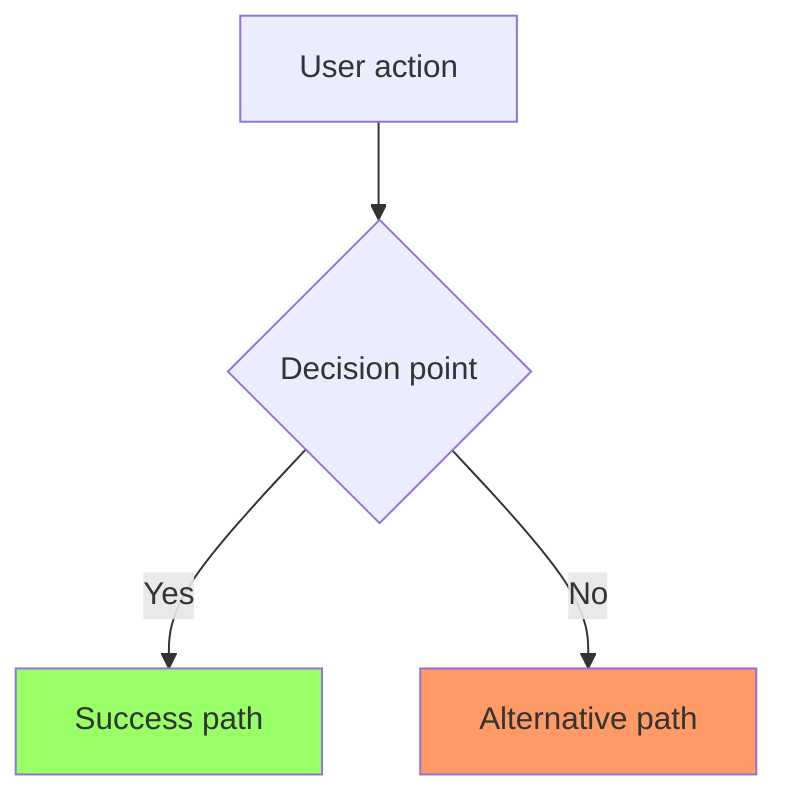
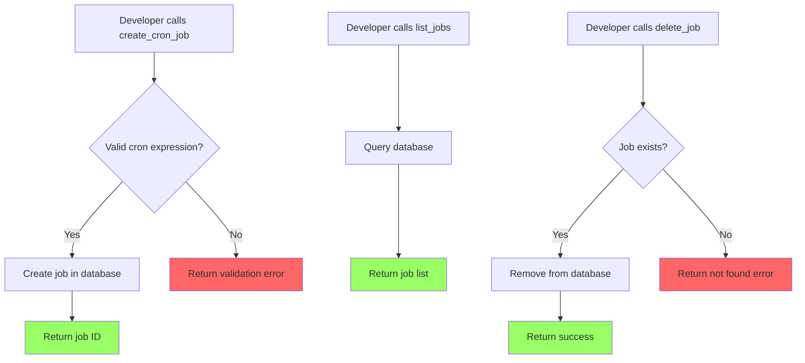

# Create User Story

Create detailed user stories for $ARGUMENTS with BDD acceptance criteria following agile best practices.

## What This Command Creates

Creates comprehensive user stories with:

- User persona and feature statement (As a... I want... So that...)
- Mermaid flow diagram showing the user journey
- Detailed narrative with business rules
- Non-functional requirements (UX-focused, not metrics-based)
- Gherkin acceptance criteria (Given/When/Then)

## Process

### 1. Get Current Date

Retrieves current date for story documentation using a shell command.

### 2. Check for PRD Context

If a PRD exists in `docs/`:

- Read PRD for product context
- Use PRD features to inform story scope
- Align acceptance criteria with PRD goals

### 3. Ask Clarifying Questions

**IMPORTANT**: Use the AskUserQuestionTool to ask clarifying questions.
Only ask questions about genuinely unclear aspects. Do NOT ask about:

- Information already in the PRD or command
- Established patterns from CLAUDE.md
- Information from recent conversation context

**Before writing ANY story:**

- Review story requirements
- Uncover edge cases and missing requirements
- Use lettered questions (a, b, c) with numbered answers (1, 2, 3)
- Wait for user responses before proceeding

### 4. Create User Story

- Create story in appropriate directory
- Follow established agile story format
- Include all required sections

## Story Structure

### File Location

- **Path**: `docs/stories/{STORY-ID}-{short-description}.md`
- **Example**: `docs/stories/CRONTY-1-cron-job-scheduling.md`
- **Format**: `{PREFIX}-{NUMBER}` (e.g., CRONTY-1, CRONTY-2)

### Story Template

````markdown
# User Story: [Feature Title]

**Story ID**: [STORY-ID]
**Created**: [Date]

## User Persona

[Primary user type - e.g., "A developer integrating with the MCP server"]

## Feature Statement

As a [user persona],
I want [feature/capability]
so that [benefit/value].

## Flow Diagram


````

## Narrative

Comprehensive description covering:

- Feature overview and context
- Detailed user flow
- Business rules and logic
- Edge cases and error handling

## Non-functional Requirements

Focus on perceived user experience, not absolute metrics.

### Loading & Feedback

- Does this operation need a progress indicator or is it instant enough to feel immediate?
- Should the client block during async operations?

### Error Handling

- Clear error messages for validation failures
- Graceful degradation when services are unavailable

### Reliability

- Retry behavior for transient failures
- Data consistency guarantees

## Acceptance Criteria

### Scenario: [Happy Path Name]

```gherkin
Given [context/precondition]
When [action/event]
Then [expected outcome]
And [additional outcomes]
```

### Scenario: [Error Case Name]

```gherkin
Given [context/precondition]
When [action/event]
Then [expected error handling]
```

## Flow Diagram Best Practices

### Styling Guidelines

- **Error states**: `fill:#f66` (red)
- **Success states**: `fill:#9f6` (green)
- **Special actions**: `fill:#69f` (blue)
- **Warning states**: `fill:#f96` (orange)

### Content Guidelines

- Start with user entry point
- Show all decision branches
- Include error paths and recovery
- Use clear, descriptive labels

## Acceptance Criteria Best Practices

### Comprehensive Coverage

- Happy path scenarios
- Error conditions and edge cases
- Validation rules and constraints
- Different user states
- Boundary conditions

### Writing Style

- Write from user's perspective
- Use specific, testable language
- Include exact error messages
- Specify measurable outcomes

## Example Story

````markdown
# User Story: Cron Job Scheduling

**Story ID**: CRONTY-1
**Created**: 2025-01-24

## User Persona

A developer using the MCP server to automate scheduled tasks.

## Feature Statement

As a developer,
I want to create and manage cron jobs through MCP tools
so that I can automate recurring tasks without building my own scheduler.

## Flow Diagram



## Narrative

The cron job scheduling feature is the core capability of the MCP server. It allows developers to create scheduled tasks using standard cron expressions.

The feature consists of three tools:

1. **create_cron_job**: Creates a new scheduled job with a cron expression and command
2. **list_jobs**: Returns all jobs with optional filtering by status
3. **delete_job**: Removes a job by its ID

Jobs are persisted to SQLite so they survive server restarts. The scheduler runs in the background and executes jobs at their scheduled times.

## Non-functional Requirements

### Loading & Feedback

- Job creation should feel instant (< 100ms response time)
- List operations should handle hundreds of jobs efficiently
- Long-running job executions should not block the MCP server

### Error Handling

- Invalid cron expressions return clear validation errors
- Missing jobs return 404-style not found errors
- Database errors are logged and return generic failure messages

### Reliability

- Jobs are persisted before acknowledging creation
- Failed job executions are logged with error details
- Server restart resumes all pending jobs

## Acceptance Criteria

### Scenario: Developer creates a new cron job

```gherkin
Given I have the MCP server running
When I call create_cron_job with expression "0 * * * *" and command "echo hello"
Then a new job should be created
And I should receive the job ID
And the job should appear in list_jobs results
```

### Scenario: Developer creates job with invalid expression

```gherkin
Given I have the MCP server running
When I call create_cron_job with expression "invalid" and command "echo hello"
Then I should receive a validation error
And the error should explain the cron expression format
```

### Scenario: Developer deletes an existing job

```gherkin
Given I have a job with ID "job-123"
When I call delete_job with ID "job-123"
Then the job should be removed
And it should no longer appear in list_jobs results
```

### Scenario: Developer tries to delete non-existent job

```gherkin
Given no job exists with ID "job-999"
When I call delete_job with ID "job-999"
Then I should receive a not found error
```
````

## Example Clarifying Questions

```
a) Should jobs support one-time execution or only recurring?
  1) Only recurring (standard cron)
  2) Both recurring and one-time
  3) Only one-time (scheduled tasks)

b) What happens when a job execution fails?
  1) Log the error and continue
  2) Retry with exponential backoff
  3) Disable the job after N failures

c) Should jobs support timezone configuration?
  1) No, always use server timezone
  2) Yes, per-job timezone setting
  3) Yes, global timezone configuration
```

## After Story Creation

- Story is created but implementation doesn't start automatically
- Use `/phased-plan` command to create implementation plan
- Use `/implement` command to begin development
- Stories serve as reference during development and testing

## Usage Examples

When creating stories, describe the feature and any constraints or requirements.

```
/story CRONTY-1 Cron job scheduling

Implement the core cron job scheduling tools: create, list, and delete jobs.

Jobs should be persisted to SQLite and support standard 5-field cron expressions.
```

```
/story CRONTY-2 Job execution history

Add a resource to view job execution history with timestamps, status, and output.

Support filtering by job ID, date range, and execution status (success/failure).
```

```
/story CRONTY-3 Notification prompts

Create prompts that help users set up common notification patterns like daily summaries or error alerts.
```
